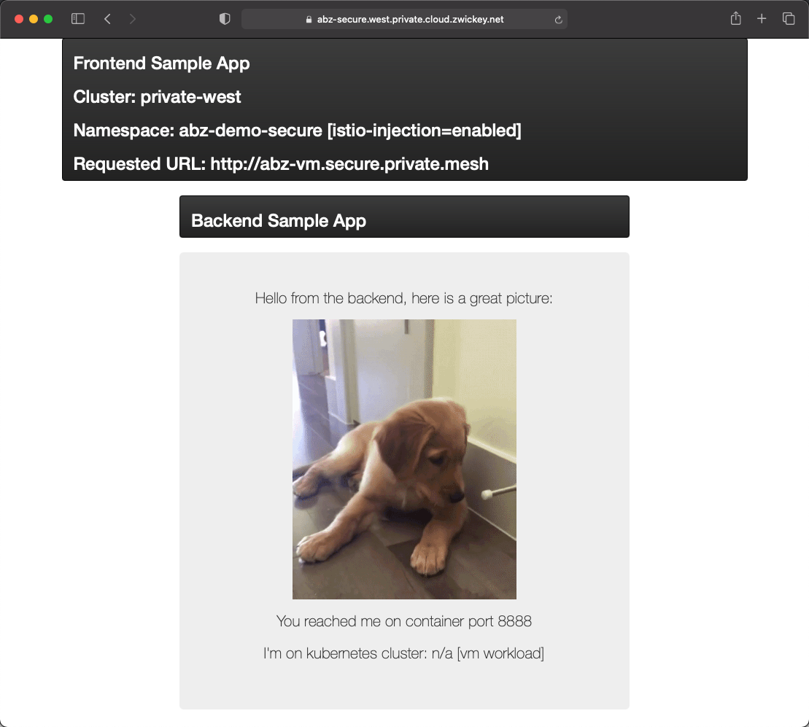
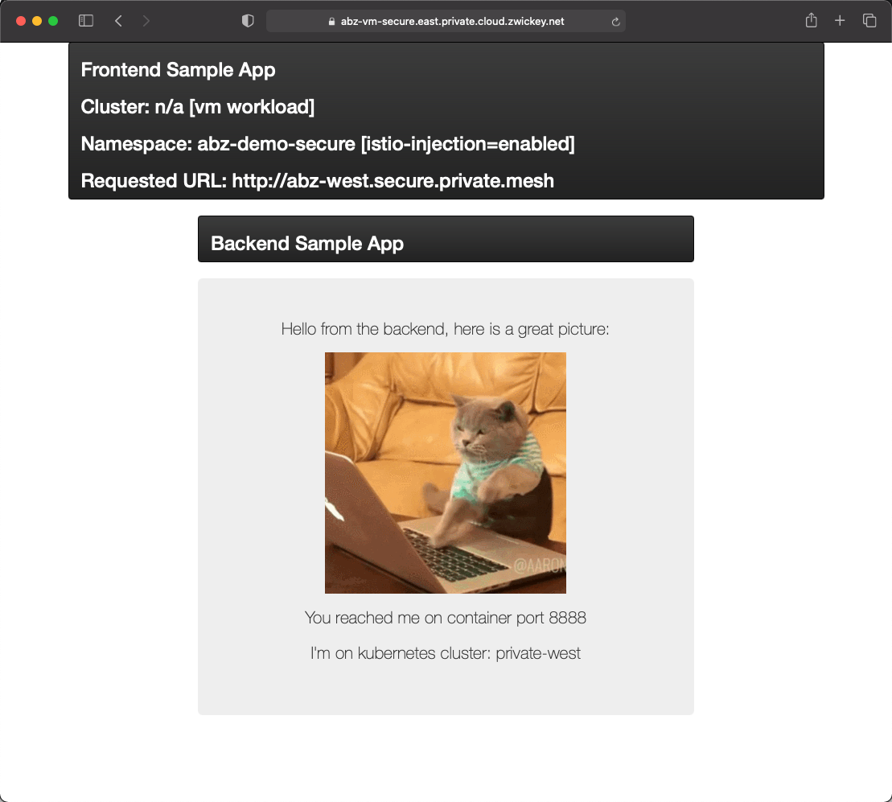

# Overview
 Although containers and Kubernetes are widely used, there are still many services deployed on virtual machines (VM) and APIs outside of the Kubernetes cluster that needs to be managed by TSB. It is possible to bring this VM into the Istio mesh. To successfully extend an Istio/Kubernetes cluster with a VM, the following steps must be taken:

- **Authentication:** The VM must establish an authenticated encrypted session to the control plane. The VM must prove that it is allowed to join the cluster.
- **Routing:** The VM must be aware of the services defined in the Kubernetes cluster and vice-versa. If the VM runs a service, it must be visible to pods running inside the cluster.

Onboarding a Virtual Machine (VM) into a TSB managed Istio service mesh can be broken down into the following steps:

- Registering the VM `workload` with the Istio control plane (WorkloadEntry)
- Obtaining a bootstrap security token and seed configuration for the Istio Proxy that will run on the VM
- Transferring the bootstrap security token and seed configuration to the VM
- Starting Istio Proxy on the VM

To improve the user experience with VM onboarding, TSB comes with `tctl` CLI that automates most of these tasks. At a high level, `tctl` aims to streamline VM onboarding flow down to a single command:

```sh
tctl x sidecar-bootstrap
```

The registration of the VM workload with the service mesh is driven by the configuration inside the `WorkloadEntry` resource. `tctl` sidecar bootstrap allows you to onboard VMs in various network and deployment scenarios to your service mesh on Kubernetes. The `tctl` sidecar bootstrap also allows VM onboarding to be reproduced at any point from any context, by a developer machine, or a CI/CD pipeline.

## Onboarding a VM
We will onboard our backend and frontend applications into our Mesh to demonstrate the following scenarios:
- Traffic originating from the Global Service mesh routing the backend application on the VM
- Frontend application on the VM making requests to containerized apps via the Global Service Mesh.

For simplicity's sake, we'll utilize our jumpbox to run our VM applications; in other words our jumpbox will be onboarded into the Global Service Mesh.

### Containerized apps making request(s) to legacy app
First we will onboard the jumpbox VM as the *Backend* application.  We will be able to utilze one of the Frontend container applications already deployed to the Global Service Mesh to test access to the backend app deployed to the VM.

1. First change your kubecontext to the `private east` cluster. Additionally, doublecheck that your `$PREFIX` environment variable is set correctly.  

2. When we onboard a VM, the Istio objects that are created will need to refer to both internal and external IP addresses of the VM.  Execute a simple helper script that will query the local EC2 instance metadata server endpoint (`http://169.254.169.254/latest/meta-data`) and set environment variables with the IPs used in your env.

```bash
source 04-VM/vm-env.sh
``` 

3. Our VM workloads will utilize a `ServiceAccount` named `vm-sa`.  Create this using kubectl:
```bash
kubectl create sa vm-sa -n $PREFIX-demo-secure
``` 

4. Create `WorkloadEntry`, `Sidecar`, `Service` objects using `kubectl`:
```bash
envsubst < 04-VM/01-backend-vm.yaml | kubectl apply -f -
``` 

Lets examine the relevant portions of the config we just applied to prepare our mesh (and kubernetes) to onboard the VM within the file `04-VM/01-backend-vm.yaml`
- First, we created a kubernetes `Service` that is idential to the existing backend service with the exception of the workload selector targeting a different app label:
```yaml
selector:
  app: backend-vm
```

- Next, you will note the definition of the `WorkloadEntry`, which, in effect, *registers* a VM with kubernetes and the service mesh.  First you'll note a set of annotations that are used by the bootstrapping process and are relevant for how the envoy proxy gets initially setup on the VM
```yaml
annotations:
  sidecar-bootstrap.istio.io/ssh-host: $EXTERNAL_IP
  sidecar-bootstrap.istio.io/ssh-user: ec2-user
  sidecar-bootstrap.istio.io/proxy-config-dir: /etc/istio-proxy
  sidecar-bootstrap.istio.io/proxy-image-hub: docker.io/tetrate
  sidecar-bootstrap.istio.io/proxy-instance-ip: $INTERNAL_IP
```

You'll also note a pretty simple `spec` definition that will inform the mesh how to connect to the envoy proxy (and visa versa) along with the labels that can be used to select our VM and associate with a other kubernetes objects, such as our `Service` we just defined.  The `network` attribute is also important as this instructs the mesh whether the VM and pods are directly routable or if there is a gateway required for communication.
```yaml
spec:
  address: $INTERNAL_IP
  labels:
    cloud: private
    class: vm
    app: backend-vm
  serviceAccount: vm-sa
  network: aws-vms
```
- Lastly, the `Sidecar` controls the mesh configuration for the VM envoy proxy -- aka the sidecar.  Most importantly, you'll note two sections in the `spec` that outline how ingress and egress are configured for the VM workload and the proxy.  
```yaml
ingress:
- port:
    number: 8888
    protocol: HTTP
    name: http
    defaultEndpoint: 127.0.0.1:8888
egress:
- bind: 127.0.0.2
    hosts:
    - "./*"
    - xcp-multicluster/*
```

5. At this point our service mesh and kubernetes cluster is configured and ready to go but our envoy proxy is not running or configured on our VM.  We'll use the sidecar-bootstrap command within the `tctl` cli to install the istio-proxy and join the VM to the mesh.  First, execute the command with the `--dry-run` flag so that you are able to see what is involved in th eprocess of bootstrapping.

```bash
tctl x sidecar-bootstrap backend-vm -n $PREFIX-demo-secure --start-istio-proxy --ssh-key ~/abz.pem --dry-run
```

Next, run the command without the dry run flag to complete the onboarding.  

```bash
tctl x sidecar-bootstrap backend-vm -n $PREFIX-demo-secure --start-istio-proxy --ssh-key ~/abz.pem 
```

We can verify the bootstapping process by making sure that the envoy docker container has been started up on the host:

```bash
docker ps
```
```bash
CONTAINER ID   IMAGE                                            COMMAND                  CREATED         STATUS         PORTS     NAMES
b1cb3cf79fe8   tetrate/proxyv2:1.8.6-p1-a924eb8aa1-distroless   "/usr/local/bin/pilo…"   5 seconds ago   Up 5 seconds             istio-proxy 
```

6. Though our VM is onboarded with a proxy configured and running, our backend application hasn't been started.  This is a simple Go application binary that relies on a few environment variables.  Start the app with the following commands:

```bash
source 04-VM/backend-env.sh
04-VM/backend &
```

7. Lastly, in order for us to route to this VM workload over the global mesh, we need to create a the listener on our `IngressGateway` that will broadcast globally how to discover and connect to the service.  Apply this configuration using the `tctl apply` command:

```bash
envsubst < 04-VM/01a-backend-tsb.yaml | tctl apply -f -  
```

This configuration file is nearly identical to the application configuration we applied in lab 2 except that we are adding a listener that will route to our `backend-vm` kubernetes service, which is mapped to our VM via configured workload selectors.  

```yaml
- name: secure-backend-vm-internal
  port: 80
  hostname: vm.secure.$PREFIX.private.mesh
  routing:
  rules:
  - route:
    host: "$PREFIX-demo-secure/backend-vm.$PREFIX-demo-secure.svc.cluster.local"
    port: 80
```

8. Now we can test our VM service via the mesh.  We will test via the frontend application that is running in our Private West cluster.  Open a browser and navigate to secure.west.private.$PREFIX.cloud.zwickey.net (replace $PREFIX with your actual prefix).  In the Backend HTTP URL field enter the URL route we just configured, which should be in the form of vm.secure.$PREFIX.private.mesh.  We should see a response from our VM backend, which is serving a cute puppy pic!



9. We could also verify that communication is working properly by looking at log files on our VM.  In your terminal window, you should have noticed a message logged to the STDOUT console by the backend application:

```bash
2021/09/07 19:07:29 CatHandler: request received from 127.0.0.1:54658
```

Additionally, you can also see logs in the envoy proxy sidecar container that is running on the VM.  These can be retrieved using the `docker logs` command:

```bash
docker logs istio-proxy
```
```bash
.....
[2021-09-08T19:47:34.206Z] "GET / HTTP/1.1" 200 - "-" 0 1750 1 0 "10.128.0.1" "Go-http-client/1.1" "2f6617c3-4b24-9971-ba8d-da4bdffa2b0a" "abz-vm.secure.private.mesh" "127.0.0.1:8888" inbound|8888|| 127.0.0.1:56210 10.0.93.162:8888 10.128.0.1:0 outbound_.80_._.backend-vm.abz-demo-secure.svc.cluster.local default
```

9. Cleanup!  We're going to use the same VM to demonstrate global mesh service and routing egress from the VM workload back into the global service mesh.  So we need to stop and clean up the processes we just started.

- Kill the backend process by bringing it to the foreground and entering `control+c`:
```bash
fg   

^C  <control+c>
```

- Stop and remove the istio-proxy docker container
```bash
docker stop istio-proxy
docker rm istio-proxy
```

- Remove the security token and mesh configuration delivered to the VM via the boostrapping process found in `/etc/istio-proxy`:
```bash
rm /etc/istio-proxy/*
```

### Legacy app making request(s) to containerized apps
Now we will onboard the jumpbox VM as the *frontend* application.  We will utilze one of the backend container applications already deployed to the Global Service Mesh to test routing and service discovery from the VM.  The process will be very similar to onboarding as a backend.


1. Create `WorkloadEntry`, `Sidecar`, `Service` objects using `kubectl`:
```bash
envsubst < 04-VM/02-frontend-vm.yaml | kubectl apply -f -
```

Feel free to inspect the config we just applied in the file `02-frontend-vm.yaml`.  However, you'll note this is nearly idenitcal to the backend with the exception of object names and workload selectors.


2. As we did with the previous steps, we'll use the sidecar-bootstrap command within the `tctl` cli to install the istio-proxy and join the VM to the mesh:

```bash
tctl x sidecar-bootstrap frontend-vm -n $PREFIX-demo-secure --start-istio-proxy --ssh-key ~/abz.pem
```

3. Now we need to start the frontend application on the VM.  This is a simple Go application binary that relies on a few environment variables.  Start the app with the following commands:

```bash
source 04-VM/frontend-env.sh
04-VM/frontend &
```

4. Lastly, we'll want to be able to access our frontend application on the VM via our local browser.  For this, we need to create a listener on our `IngressGateway` that is exposed externally.  Apply this configuration using the `tctl apply` command:

```bash
envsubst < 04-VM/02a-frontend-tsb.yaml | tctl apply -f -  
```

This configuration file is nearly identical to the application configuration we applied in lab 2 except that we are adding a listener that will route to our `frontend-vm` kubernetes service, which is mapped to our VM via configured workload selectors.  It will be exposed via an external FQDN using TSL encryption:

```yaml
- name: secure-gateway-vm
  port: 443
  tls:
    mode: SIMPLE
    secretName: frontend-vm-certs
  hostname: vm.secure.private.$PREFIX.cloud.zwickey.net
    routing:
      rules:
      - route:
          host: "$PREFIX-demo-secure/frontend-vm.$PREFIX-demo-secure.svc.cluster.local"
          port: 8080
```

5. Now we can test our frontend VM service and access other containerized services via the Global Mesh.  Open a browser and navigate to vm.secure.private.$PREFIX.cloud.zwickey.net (replace $PREFIX with your actual prefix).  We'll test routing from this VM across to our Private West cluster and access the backend.  In the Backend HTTP URL field enter the URL for the private west backend: west.secure.$PREFIX.private.mesh

You should receive a response from the backend with the cat picture!



