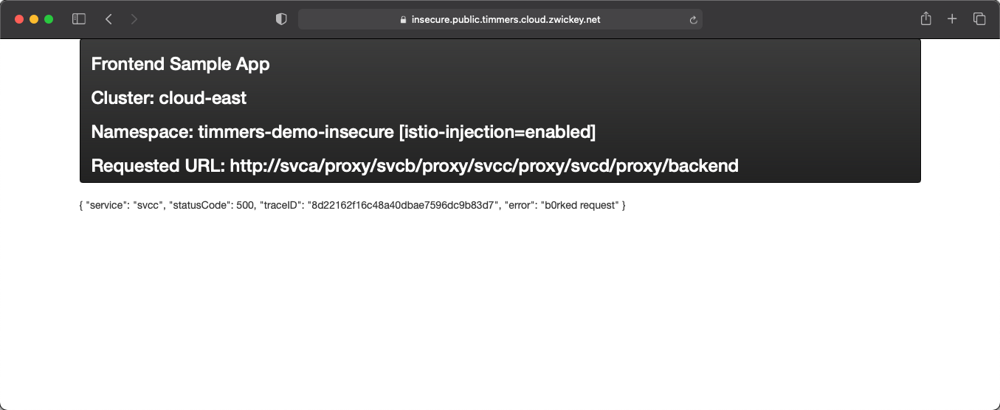
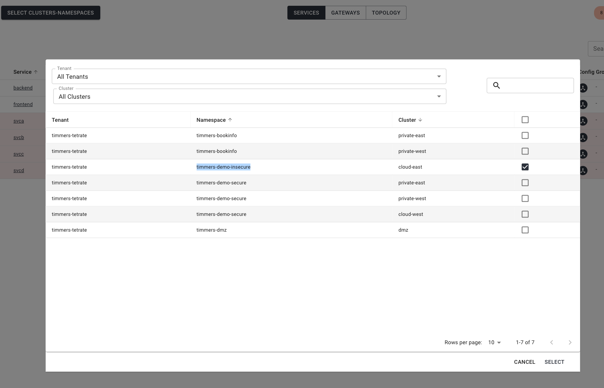

# Overview
One of the big benefits of a Service Mesh is the ability to gain insight into an application's behavior by collecting metrics, logs, and traces that are captured at the Envoy sidecar.  In this lab we will see how TSB can assist application owners in debugging and troubleshooting application issues.

## Deploy the application

- First we will need to deploy another helper application that can be used to simulate a misbehaving application and also demonstrate a more complex chain of microservices that call each other.  We will be configuring this in the Public Cloud East cluster, our insecure application, so ensure that your kubecontext is pointed to the public east cluster.  Deploy the sample proxy application using `kubectl apply`:

```bash
SVCNAME=svca envsubst < 07-Debugging/00-app.yaml | kubectl apply -f -
SVCNAME=svcb envsubst < 07-Debugging/00-app.yaml | kubectl apply -f -
SVCNAME=svcc envsubst < 07-Debugging/00-app.yaml | kubectl apply -f -
SVCNAME=svcd envsubst < 07-Debugging/00-app.yaml | kubectl apply -f -
```
- We can test our proxied application from our Frontend application that we have been utilizing throughout this workshop.  Open your browser and navigate to https://insecure.public.$PREFIX.cloud.zwickey.net.  Replace $PREFIX in the URL with your prefix value.  The application should display in your browser.  Enter the follwing address in the Backend HTTP URL text box:  `svca/proxy/svcb/proxy/svcc/proxy/svcd/proxy/backend`.  This will kickoff a microservice to microservice call chain that will traverse `svca -> svcb -> svcc -> svcd` before finally invoking our `backend` microservice.


Refresh the browser about 10 to 15 times to generate a bit of traffic on the services.

- Next we will configure 2 of the services to have a bit of latency and also return some errors for a small percentage of requests.  Execute the following `curl` commands, which will set a few properties on `svcb` and `svcc` to simulate failures:

```bash
curl https://insecure.public.$PREFIX.cloud.zwickey.net/proxy/\?url\=svcc%2Ferrors%2F33\&auth\=\&cachebuster\=123
curl https://insecure.public.$PREFIX.cloud.zwickey.net/proxy/\?url\=svcb%2Flatency%2F2000\&auth\=\&cachebuster\=123
```

- Return to you browser and refresh the page 10-15 more times.  You'll notice a bit of latency on the requests and some of the request may return errors.



## Troubleshoot using TSB
Now lets utilize the TSB applicatoion to troubleshoot and debug our application.  If you don't already have it open, navigate a new browser tab to `https://tsb.demo.zwickey.net/admin/login`.  Select `Log in with OIDC` and when prompted enter your TSB credentials.  These can be found in the shared google sheet that you obtained jumpbox information from.  Once logged you will be routed to the Dashboard view.  You'll want to limit the services displayed to just the services we've been recently invoking.  Click the `SELECT CLUSTERS-NAMESPACES` button and select clusters/namespaces for `<PREFIX>-demo-insecure`, which is in the `cloud-east` cluster.



- Topology
- Dashboard Registry
- Trace

- Let remove the simulated failures for the microservices.  Execute the following `curl` commands:

```bash
curl https://insecure.public.foo.cloud.zwickey.net/proxy/\?url\=svcc%2Ferrors%2F0\&auth\=\&cachebuster\=123
curl https://insecure.public.foo.cloud.zwickey.net/proxy/\?url\=svcb%2Flatency%2F0\&auth\=\&cachebuster\=456
```

- Metrics???