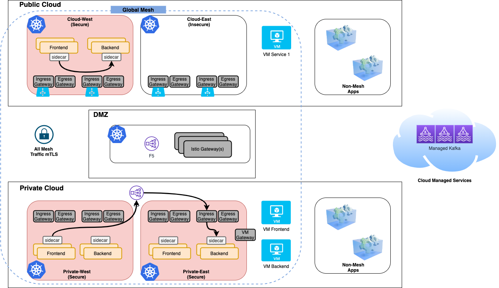
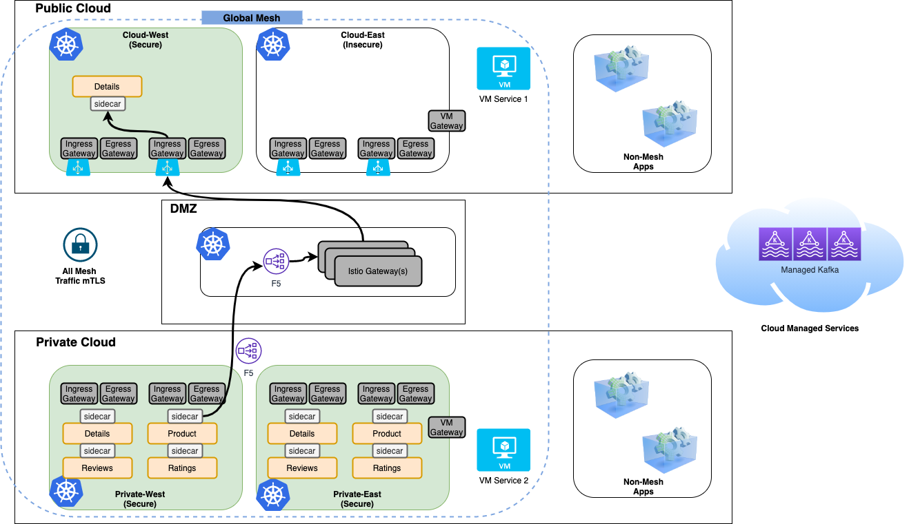

# Overview
This workshop provides Platform Operators, Application Developers, and Application Operators with hands on experience deploying and securing multi-cloud applications utilizing Tetrate Service Bridge.  Included are presentations, demos and hands on labs.

The target state infrastucture archiecture is comprised of 5 kubernetes clusters:
- 2 clusters in the public cloud one deployed in the  east region and the other in  west region
- 2 clusters on-premises one deployed in an east region and another in  west region.  Within the "east" region we will add legacy VM workloads to the env.
- One cluster deployed in a "DMZ" that facilitates a controlled point for securing communication traversing public and private clouds.


## Workshop Topics
IMPORTANT: Each new exercise builds upon the preceding lab, so please do not skip around the labs!

[Tetrate Overview](https://docs.google.com/presentation/d/11VD8G8uFDSjRqtPNJmxZUND7hlc3kiY6bGNhNRBxbJ8/edit#slide=id.gb61fe1c3b5_0_0)

- Deploy Applications: [Lab](00-App-Deployment/README.md)
- Setup Multi-Tenancy: [Slides](https://docs.google.com/presentation/d/11VD8G8uFDSjRqtPNJmxZUND7hlc3kiY6bGNhNRBxbJ8/edit#slide=id.ge82d745ba0_0_716) [Lab](01-Tenancy/README.md)
- Application Config: [Lab](02-App-Config/README.md)
- Security Policies: [Slides](https://docs.google.com/presentation/d/11VD8G8uFDSjRqtPNJmxZUND7hlc3kiY6bGNhNRBxbJ8/edit#slide=id.ge82d745ba0_0_737) [Lab](03-Security/README.md)
- Legacy VM Workloads: [Slides](https://docs.google.com/presentation/d/11VD8G8uFDSjRqtPNJmxZUND7hlc3kiY6bGNhNRBxbJ8/edit#slide=id.ge82d745ba0_0_731) [Lab](04-VM/README.md)
- Multi-Cloud & Multi-Cluster Traffic Mgmt: [Slides](https://docs.google.com/presentation/d/11VD8G8uFDSjRqtPNJmxZUND7hlc3kiY6bGNhNRBxbJ8/edit#slide=id.ge82d745ba0_0_731) [Lab](05-LB/README.md)
- Envoy Filters: [Slides](https://docs.google.com/presentation/d/11VD8G8uFDSjRqtPNJmxZUND7hlc3kiY6bGNhNRBxbJ8/edit#slide=id.ge82d745ba0_0_731) [Lab](06-Envoy/README.md)
- Application Debugging: [Slides](https://docs.google.com/presentation/d/11VD8G8uFDSjRqtPNJmxZUND7hlc3kiY6bGNhNRBxbJ8/edit#slide=id.ge82d745ba0_0_743) [Lab](07-Debugging/README.md)

## Environment Access Information
The majority of the workshop will be executed via a jumpbox that has all the prerequisite CLIs installed.  Using the shared google doc provided by, *checkout* a jumpbox by adding your name to the sheet in the `Reserved Workshop User` column.  This shared document has TSB user/pwd and IP address for your jumpbox.

- Access jumpbox using the private key provided by tetrate:

Please run the follwoing command to change permissions for file. 
```bash
chmod 400 abz.pem
```
 
```bash
ssh -i abz.pem ec2-user@<JUMPBOX IP ADDRESS>
```
- Throughout the workshop you will be required to have an environment variable set in your jumpbox session named `PREFIX`.  This will be used to ensure your various kubernetes objects and TSB objects have unique names.  The PREFIX assigned to you is found in the shared google docs in the `Prefix` column of the jumpbox you checked out.  export this env var:
```bash
export PREFIX=<YOUR JUIMPBOX PREFIX>
```


- All labs will assume you have changed directories to the workshop git directory, which has already been checked out onto the jumpbox.  This is found in the `dmz-workshop` directory.  Also, it wouldn't hurt to doublecheck that you have the latest code checked out, just in case there are last minute changes that were committed after the jumpbox was created.
```bash
cd ~/dmz-workshop
git pull
```

- The jumpbox should already be logged into each kubernetes cluster.  If you recieve a message that you are not logged in you can execute the 2 helper scripts on the jumpbox that will log you in.
```bash
~/login-cloud.sh
~/login-openshift.sh

```

- During your workshop you will be utilizing the TCTL CLI.  If you recieve a message that you are not logged in you can execute the helper script on the jumpbox that will log you in.
```bash
~/login-tctl.sh

```

- You will also need to frequently change kubernetes clusters via your kubecontext.  The jumpbox has `kubectx` installed to facilitate this.  You can list contexts by issuing the command `kubectx` and you can change you context with the command `kubectx <CONTEXT NAME>`.

## Applications

During this workshop we will be modeling 3 different applications that allow for various architecture and security patterns that span Multi-Cluster and Multi-Cloud.

### Secure Application
A simple frontend and backend application that allows simple testing of mesh networking and security.  This application spans the Public Cloud West cluster and both on-premises clusters.  This application also has VM versions of the services running in the private east region.




### Insecure Application
Identical application to the `Secure Application`, except it is only deployed into the Public Cloud East cluster, which we will utilize as the Insecure Cluster.


### Multi-Cluster Bookinfo Application
This is the canonical [Istio demo application, Bookinfo.](https://istio.io/latest/docs/examples/bookinfo/)  The microservice application displays information about a book, similar to a single catalog entry of an online book store.  This application spans is fully deployed to both on-premises clusters In this manner, we can demonstrate advanced routing and service discovery patterns.



